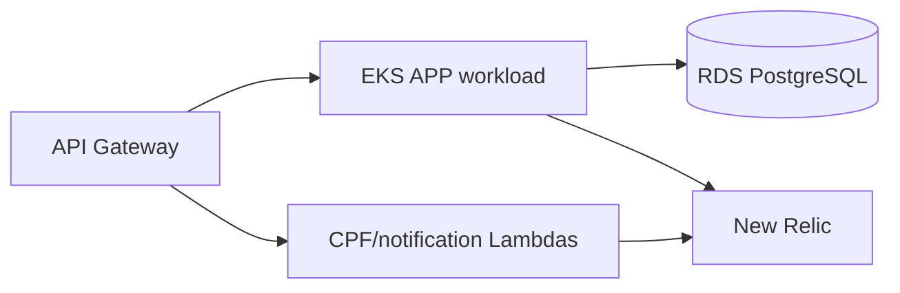

# Oficina Kubernetes infrastructure

See [repository architecture](docs/architecture.md) and the APP [credential-free API snapshot](../Tech-challenge-15SOAT/docs/phase-3/api/contracts.md). No cloud deployment is represented as active.



Technologies: Terraform 1.15.8, Kubernetes manifests/Kustomize, AWS EKS/API Gateway/Lambda, and New Relic chart configuration. Prerequisites: Terraform 1.15.8, PowerShell, and optionally Helm for the CI-gated chart render. This repository has no application API; its private executor image is defined in [images/deployer/Dockerfile](images/deployer/Dockerfile).

This repository owns the Kubernetes/EKS infrastructure boundary for Oficina staging and production. Terraform roots and workflows are committed under `infra/` and `.github/workflows`; review [requirements and acceptance gaps](docs/evidence/requirements.md) before interpreting their status.

The environment platform lives in `infra/environments/{staging,production}` and `k8s/platform`. It creates isolated namespaces, fixed internal HTTP API integrations and workload policies while consuming the shared foundation's ALB, VPC link and EKS values. Render manifests without cluster or AWS access:

```powershell
pwsh ./tests/platform-manifests-tests.ps1
terraform -chdir=infra/monitoring init -backend=false
terraform -chdir=infra/monitoring fmt -check
terraform -chdir=infra/monitoring validate
terraform -chdir=infra/monitoring test
pwsh -NoProfile -File ./tests/newrelic-chart-tests.ps1
```

Remote owner, visibility, protected branches, environment credentials, and deployment targets are external release prerequisites; this documentation audit neither changes nor verifies their current live settings.

The CI/CD contract is documented in [docs/deployment-sequence.md](docs/deployment-sequence.md). The external-protection checklist, output schema, ordered handoff, and R4 evidence boundary are in [docs/release-readiness.md](docs/release-readiness.md). Its local verification has no AWS or GitHub side effects:

```powershell
pwsh ./tests/pipeline-contract.ps1
pwsh ./tests/release-readiness-contract.ps1
```

CI is [`.github/workflows/ci-cd.yml`](.github/workflows/ci-cd.yml): pull requests and pushes to `develop`/`main` run `local-contracts`; a push to either protected branch can enter its configured staging/production handoff. The protected release handoff is documented in [deployment sequence](docs/deployment-sequence.md). Apply/deploy needs reviewed environment inputs and an authorized R4 window.
