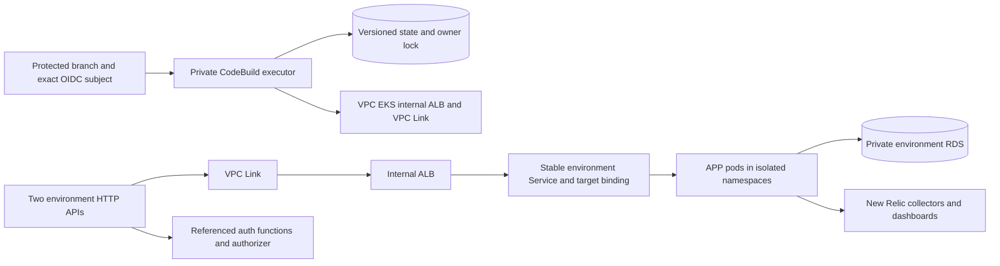
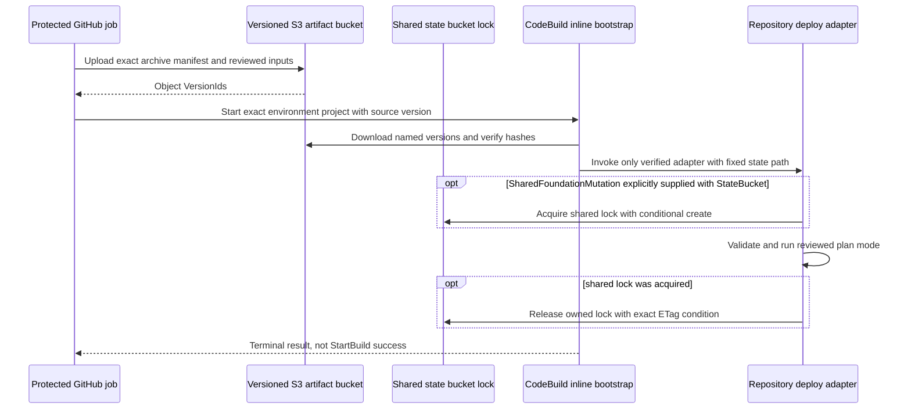

# K8S architecture

K8S owns foundation/bootstrap, EKS, API/stage, private routing, namespace policy, stable Service/binding, workload templates and monitoring. It references APP/FUN/DB contracts. Earlier function/runtime definitions still overlap FUN's new I5 source: [review one owner](../../oficina-functions/docs/runtime-permissions.md) before activating FUN. This infrastructure repository exposes no application API, but it does contain the [private deployer Dockerfile](../images/deployer/Dockerfile). Consumers use the [APP API snapshot](../../Tech-challenge-15SOAT/docs/phase-3/api/contracts.md).

The shared-lock arrows are conditional: `scripts/deploy.ps1` acquires that lock only when `-SharedFoundationMutation` and the reviewed `-StateBucket` are supplied. The current platform-owned inline executor invocation supplies the Terraform backend arguments but forwards neither of those two parameters. Its ordinary K8S path therefore has per-state Terraform locking, not the shared-foundation lock shown in the optional branch. Wiring shared mutations through that guarded path remains an explicit activation prerequisite; this diagram does not claim that wiring exists.

No full Terraform state is a cross-repository interface: consumers use [allowlisted outputs](../contracts/outputs-allowlist.json). Kubernetes controllers own target registration; Terraform owns fixed target-group identity. PostgreSQL schema and runtime credentials remain APP-owned; [DB architecture](../../oficina-db-infra/docs/architecture.md) explains relational/service separation.

Technologies: Terraform 1.15.8, Kubernetes/Kustomize, EKS, API Gateway, S3/CodeBuild and New Relic Helm. Prerequisites: PowerShell 7, Terraform, kubectl for rendering and Helm for chart checks. Deployment additionally needs reviewed account/region/inputs, environment protection, fresh window and a compatible immutable deployer image.

Run `pwsh -File tests/pipeline-contract.ps1`, `pwsh -File tests/application-rollout-tests.ps1`, `terraform fmt -check -recursive`, and the [monitoring/chart checks](../README.md). [CI](../.github/workflows/ci-cd.yml) maps protected develop/main pushes to staging/production; PR verification has no deployment identity.

See [requirements/evidence](evidence/requirements.md), [deployment sequence](deployment-sequence.md), [workload prerequisites](platform-workloads.md), [RFC 001](../../Tech-challenge-15SOAT/docs/rfcs/001-aws-profile.md) and [ADR 002](../../Tech-challenge-15SOAT/docs/adrs/002-environment-scaling.md). Shared EKS/NAT and Single-AZ databases are study limitations, not a high-availability claim.
