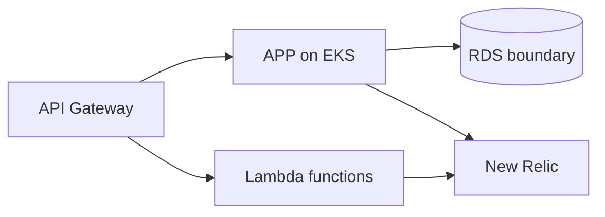

# K8S architecture

This repository owns Terraform EKS, gateway, Lambda, secret-sync and monitoring boundaries. It consumes APP/FUN/DB immutable inputs and has no API or Dockerfile. The consumer contract is the APP [credential-free API snapshot](../../Tech-challenge-15SOAT/docs/phase-3/api/contracts.md).

Technologies: Terraform 1.15.8, Kubernetes/Kustomize, AWS gateway/EKS/Lambda resources, and New Relic Helm configuration. Prerequisites are Terraform, PowerShell, and Helm only for the CI render. From the root run `terraform -chdir=infra/monitoring init -backend=false`, `terraform -chdir=infra/monitoring validate`, `terraform -chdir=infra/monitoring test`, `pwsh -NoProfile -File ./tests/platform-manifests-tests.ps1`, and `pwsh -NoProfile -File ./tests/newrelic-chart-tests.ps1`. CI is [`.github/workflows/ci-cd.yml`](../.github/workflows/ci-cd.yml), triggered by pull requests and pushes to `develop`/`main`. Deployment needs protected CI, reviewed inputs, and an authorized R4 window; no active deployment is claimed.
